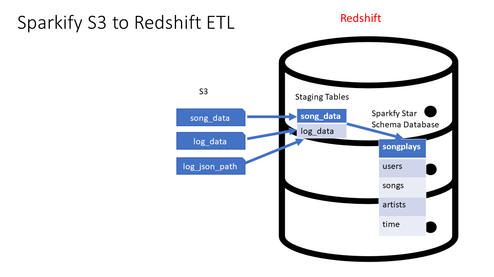

# [Udacity Nanodegree] Data Engineering with AWS - Project 2: Data Warehouse
## Introduction
A music streaming startup, Sparkify, has grown their user base and song database and want to move their processes and data onto the cloud.
Their data resides in S3, in a directory of JSON logs on user activity on the app, as well as a directory with JSON metadata on the songs in their app.

As their data engineer, you are tasked with building an ETL pipeline that extracts their data from S3, stages them in Redshift, and transforms data into a set of dimensional tables for their analytics team to continue finding insights into what songs their users are listening to.

### Technical stack
- Programming: Python, SQL
- AWS services: Redshift, S3, IAM, VPC
- Library: Boto3

